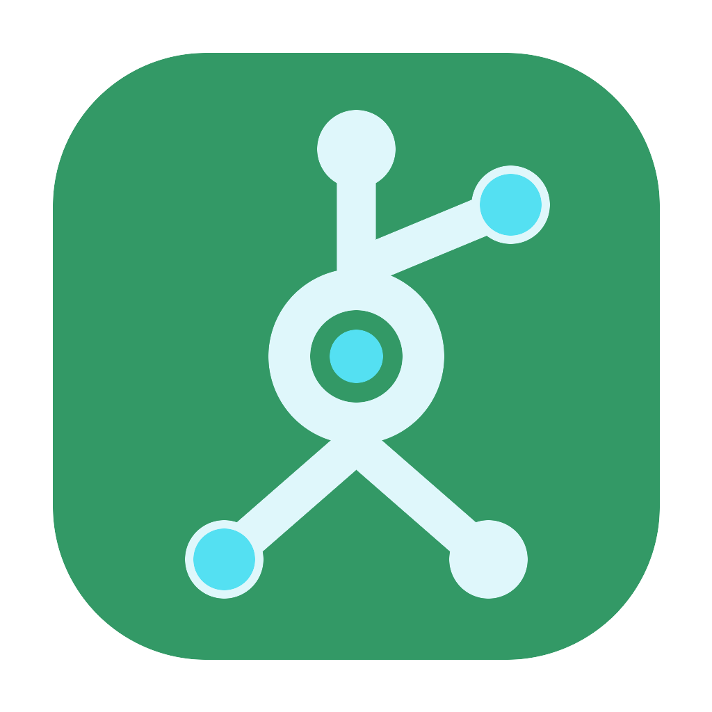

# SurProxy



SurProxy is a native macOS front end for `CLIProxyAPIPlus`.

It turns an upstream local proxy runtime into a Mac app with a real control surface: start and stop the runtime, inspect OAuth auth files, manage provider routing, rotate downstream API keys, and keep the service available from the menu bar after the main window is closed.

> `CLIProxyAPIPlus` remains the runtime and protocol source of truth.
> SurProxy is the native macOS host, control plane, and UX layer.

## What It Is

SurProxy is not a reimplementation of `CLIProxyAPIPlus`.

It uses the upstream runtime as the source of truth for:

- proxy serving
- OAuth and auth-file handling
- provider config semantics
- management APIs
- model discovery and status

SurProxy adds the native host layer:

- macOS windowed UI
- menu bar controls
- runtime installation and lifecycle management
- app-managed config ownership
- native settings and provider management flows

## Product Highlights

- **Native runtime controls**: `Start`, `Stop`, `Reload Config`, and bundled runtime reinstall actions
- **OAuth management**: upstream login entry points plus auth-file visibility with local disk fallback
- **Provider routing UI**: lazy model loading, rename/delete where supported, and per-provider proxy overrides
- **Downstream API keys**: managed through upstream management APIs
- **Global settings**: dedicated `Settings` page for SurProxy-managed `proxy-url`, `port`, and `auth-dir`
- **Menu bar presence**: the app can keep running after the main window closes

## At A Glance

- Native runtime dashboard with `Start`, `Stop`, `Reload Config`, and bundled runtime reinstall actions
- OAuth login entry points for the upstream providers supported by `CLIProxyAPIPlus`
- OAuth auth-file visibility from the management API, with local disk fallback when the API returns nothing usable
- Provider cards with lazy model loading, rename/delete where supported, and per-provider proxy overrides
- Downstream API key management through upstream management endpoints
- Dedicated `Settings` page for SurProxy-managed global runtime values:
  - global `proxy-url`
  - `port`
  - `auth-dir`
- Menu bar integration so the app can stay alive even after the main window closes

## Configuration Model

SurProxy intentionally separates its managed runtime config from the user's default upstream config.

### Runtime Layout

| Component | Location |
| --- | --- |
| Bundled runtime | `SurProxy.app/Contents/Resources/cliproxyapiplus` |
| Active runtime | `~/Library/Application Support/SurProxy/runtime/cliproxyapiplus` |
| SurProxy-managed config | `~/Library/Application Support/SurProxy/config.yaml` |
| Runtime manifest | `~/Library/Application Support/SurProxy/runtime-manifest.json` |
| Shared auth directory | `~/.cli-proxy-api/` |

### Why This Split Exists

- users may already have a different `~/.cli-proxy-api/config.yaml`
- users may already be using a different port or management key
- SurProxy must control the runtime it launches without overwriting unrelated upstream state

## Runtime Behavior

SurProxy reads and writes upstream state through management APIs wherever possible.

### Current Behavior

- OAuth proxy behavior is treated as a global runtime setting, not a per-auth-file override
- provider proxy overrides remain per-provider and follow upstream config semantics
- changing only global `proxy-url` uses upstream `PUT /v0/management/config.yaml` hot reload
- changing `port` or `auth-dir` still requires a runtime restart
- restart now waits for the old runtime process to exit before launching the replacement process

## Brand Assets

Brand and icon source materials live in [Docs](Docs/README.md).

### Included Assets

- [Icon design philosophy](Docs/Brand/icon_design_philosophy.md)
- [App icon SVG source](Docs/Brand/surproxy_app_icon.svg)
- [App icon PNG preview](Docs/Brand/surproxy_app_icon_1024.png)
- [Tray icon SVG source](Docs/Brand/surproxy_tray_icon.svg)

### Asset Catalog Wiring

- `SurProxy/Assets.xcassets/AppIcon.appiconset`
- `SurProxy/Assets.xcassets/TrayIcon.imageset`

## Development

### Upstream Source

- `Vendor/CLIProxyAPIPlus`

### Current Pinned Version

- tag: `v6.9.1-0`
- commit: `1dc4ecb1b8a6412954dd37ce4bfe0610478edcbc`

### Useful Scripts

- `Scripts/build_cliproxy_runtime.sh`
- `Scripts/stage_runtime_binary.sh`

### Build Verification

```bash
xcodebuild -project SurProxy.xcodeproj -scheme SurProxy -sdk macosx -derivedDataPath /tmp/SurProxyDerivedData CODE_SIGNING_ALLOWED=NO CODE_SIGNING_REQUIRED=NO -quiet build
```

## Note

The app target has App Sandbox disabled. The current product design needs direct access to:

- a bundled local runtime binary
- localhost management endpoints
- `~/.cli-proxy-api/`
